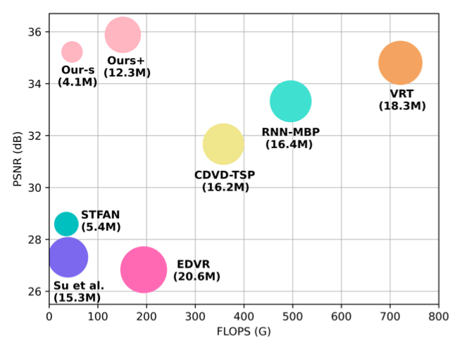
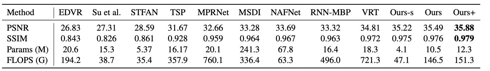

# A Simple Baseline for Video Restoration with Spatial-temporal Shift (CVPR 2023)
[paper](https://openaccess.thecvf.com/content/CVPR2023/papers/Li_A_Simple_Baseline_for_Video_Restoration_With_Grouped_Spatial-Temporal_Shift_CVPR_2023_paper.pdf)
**|** 
[supplementary](https://openaccess.thecvf.com/content/CVPR2023/supplemental/Li_A_Simple_Baseline_CVPR_2023_supplemental.pdf)
**|** 
[arxiv](https://arxiv.org/abs/2206.10810)
**|** 
[project page](https://dasongli1.github.io/publication/grouped-shift-net/)

This repository is the official PyTorch implementation of "A Simple Baseline for Video Restoration with Spatial-temporal Shift"

> **Abstract:** *Video restoration, which aims to restore clear frames from degraded videos, has numerous important applications. The key to video restoration depends on utilizing inter-frame information. However, existing deep learning methods often rely on complicated network architectures, such as optical flow estimation, deformable convolution, and cross-frame self-attention layers, resulting in high computational costs. In this study, we propose a simple yet effective framework for video restoration. Our approach is based on grouped spatial-temporal shift, which is a lightweight and straightforward technique that can implicitly capture inter-frame correspondences for multi-frame aggregation. By introducing grouped spatial shift, we attain expansive effective receptive fields. Combined with basic 2D convolution, this simple framework can effectively aggregate inter-frame information. Extensive experiments demonstrate that our framework outperforms the previous state-of-the-art method, while using less than a quarter of its computational cost, on both video deblurring and video denoising tasks. These results indicate the potential for our approach to significantly reduce computational overhead while maintaining high-quality results.* 
### Performance
<center></center>
<center></center>

### Container
Container: NVIDIA PyTorch Container [21.02](https://docs.nvidia.com/deeplearning/frameworks/pytorch-release-notes/rel_21-02.html#rel_21.02).
```
cuda 11.2.0
pytorch 1.8.0a0+52ea372
TensorRT 7.2.2.3+cuda11.1.0.024
```
### Installation
```
pip install -r requirements.txt
python setup.py develop --no_cuda_ext
```
### Data Preparation
#### 1. GoPro & DVD: download the [datasets](https://drive.google.com/drive/folders/1lCZS0mHJcnQutyupM62tNUJl8JIW8i3Q) following the instructions of [CDVD-TSP](https://github.com/csbhr/CDVD-TSP)
If you have downloaded the datasets，please put them to './dataset'. It should be like ```./datasets/GoPro/train/blur``` and ```./datasets/GoPro/train/gt```
#### 2. DAVIS: download [DAIVS-train](https://data.vision.ee.ethz.ch/csergi/share/davis/DAVIS-2017-Unsupervised-trainval-480p.zip) to ```./datasets/DAVIS/JPEGImages/480p```. Download [DAVIS-test](https://github.com/JingyunLiang/VRT/releases/download/v0.0/testset_REDS4.tar.gz) to ```./datasets/DAVIS-test```
#### 3. Set8: download [Set8](https://github.com/JingyunLiang/VRT/releases/download/v0.0/testset_Set8.tar.gz) to ```./datasets/Set8```

### Pre-trained Models
| Task                                 | Dataset | Model      | Link  |
| :----------------------------------- | :------ | :----------- | :------------------------ |
| Video Deblurring                     | GoPro   | Ours+ | [gdrive](https://drive.google.com/file/d/1f79zxmCL-ygVmoJd86OT6uksPGk2BpL0/view?usp=share_link) |
| Video Deblurring                     | GoPro   | Ours-s | [gdrive](https://drive.google.com/file/d/1WnFZRnXN9ZJebMZaAZF6a0c8f3CrLjR_/view?usp=share_link) |
| Video Deblurring                     | DVD   | Ours+ | [gdrive](https://drive.google.com/file/d/1vPQkAznRaVawQOMOuvhnCD8DKS2RQToM/view?usp=share_link)  |
| Video Deblurring                     | DVD   | Ours-s | [gdrive](https://drive.google.com/file/d/181FLpwRe87iFa-7U3myxR3nNc8qjRe-z/view?usp=share_link)  |
| Video Denoising                    | DAVIS & Set8| Ours+ | [gdrive](https://drive.google.com/file/d/1zCKZ5t7qRTTEt8_loR_Fa4ODpNOTodyM/view?usp=share_link) |
| Video Denoising                    | DAVIS & set8 | Ours-s | [gdrive](https://drive.google.com/file/d/1SJBxI2wOwgHAWx5h2N02-1UpIvEKalCg/view?usp=share_link)  |

### Inference:
#### Download the pre-trained models in ```./pretrained_models/```
#### Video Deblurring: you can adjust one_len in {8,16,24,32,48,96} according to GPU memory.
* Video Deblurring on GoPro, Ours-s:
```
python3 inference/test_deblur_small.py --default_data GOPRO --one_len 96
```
* Video Deblurring on GoPro, Ours+: 
```
python3 inference/test_deblur.py --default_data GOPRO --one_len 48
```
* Video Deblurring on DVD, Ours+: 
```
python3 inference/test_deblur.py --default_data DVD --one_len 48
```
* Video Deblurring on DVD, Ours-s:
```
python3 inference/test_deblur_small.py --default_data DVD --one_len 96
```
#### Video Denoising: 
* Video Denoising on DAVIS, Ours-s: sigma in {10,20,30,40,50}
```
python3 inference/test_denoise_small.py --default_data DAVIS --sigma 10
```
* Video Denoising on DAVIS, Ours+: sigma in {10,20,30,40,50}
```
python3 inference/test_denoise.py --default_data DAVIS --sigma 10
```
* Video Denoising on Set8, Ours-s: sigma in {10,20,30,40,50}
```
python3 inference/test_denoise_small.py --default_data Set8 --sigma 10
```
* Video Denoising on Set8, Ours+: sigma in {10,20,30,40,50}
```
python3 inference/test_denoise.py --default_data Set8 --sigma 10
```

### Visual Results

| Task                                 | Dataset | Model      | Link  |
| :----------------------------------- | :------ | :----------- | :------------------------ |
| Video Deblurring                     | GoPro   | Ours+ | [gdrive](https://drive.google.com/file/d/12wJEndw6iJtt4Vg3BeRq7G3bEewPg-Vd/view?usp=share_link) |
| Video Deblurring                     | GoPro   | Ours-s | [gdrive](https://drive.google.com/file/d/17ybazJfVpiH_RyZJtQOuzVdX3V4EdziL/view?usp=share_link) |
| Video Deblurring                     | DVD   | Ours+ | [gdrive](https://drive.google.com/file/d/1GeQPFCHiwwwBgCnrRWFD4rR7BRyX8KVi/view?usp=share_link)  |
| Video Deblurring                     | DVD   | Ours-s | [gdrive](https://drive.google.com/file/d/1R-cZj5SdrtJdgyin8fZbmunS2or6H88M/view?usp=share_link)  |
| Video Denoising                    | DAVIS   | Ours+ | [gdrive](https://drive.google.com/file/d/1HvKtdRr8qUDAK_ijFHQ6YxQ8X_dJaqZj/view?usp=share_link) |
| Video Denoising                    | DAVIS   | Ours-s | [gdrive](https://drive.google.com/file/d/15CgIFQhxAR79ovbtcpBEU1XBlfaOSdlp/view?usp=share_link)  |
| Video Denoising                    | Set8   | Ours+ | [gdrive](https://drive.google.com/file/d/1xm8EnCZqqjSciJAzmIphixUlZUqjioqP/view?usp=share_link) |
| Video Denoising                  | Set8   | Ours-s | [gdrive](https://drive.google.com/file/d/11x6IxwIEHPzCVAhiYOD41rs6yerQbzgV/view?usp=share_link) |

### Training:
#### Video Deblurring:
#### Adjust n_sequence in yml according to GPU memory. 
* Video Deblurring on GoPro, Ours-s: 
```
python -m torch.distributed.launch --nproc_per_node=8 basicsr/train1.py -opt options/gopro_deblur_small.yml --launcher pytorch
```
* Training Video Deblurring on GoPro, Ours+: 
```
python -m torch.distributed.launch --nproc_per_node=8 basicsr/train1.py -opt options/gopro_deblur.yml --launcher pytorch
```
* Video Deblurring on DVD, Ours-s: 
```
python -m torch.distributed.launch --nproc_per_node=8 basicsr/train1.py -opt options/gopro_dvd_small.yml --launcher pytorch
```
* Video Deblurring on DVD, Ours+: 
```
python -m torch.distributed.launch --nproc_per_node=8 basicsr/train1.py -opt options/gopro_dvd.yml --launcher pytorch
```
* Increasing the training iterations may further improve the performance.
#### Video Denoising:
#### Adjust n_sequence in yml according to GPU memory.
* Training Video Deblurring on DAVIS, Ours-s: 
```
python -m torch.distributed.launch --nproc_per_node=8 basicsr/train2.py -opt options/davis_denoise_small.yml --launcher pytorch
```
* Training Video Deblurring on DAVIS, Ours+:
```
python -m torch.distributed.launch --nproc_per_node=8 basicsr/train2.py -opt options/davis_denoise.yml --launcher pytorch
```
##### ```davis_denoise.yml```: adjust learning rate of Stage-2, see the difference of DAVIS performances betweeen on the [CVPR camera ready](https://openaccess.thecvf.com/content/CVPR2023/papers/Li_A_Simple_Baseline_for_Video_Restoration_With_Grouped_Spatial-Temporal_Shift_CVPR_2023_paper.pdf) and [arXiv](https://arxiv.org/abs/2206.10810):


### Citations

```
@InProceedings{Li_2023_CVPR,
    author    = {Li, Dasong and Shi, Xiaoyu and Zhang, Yi and Cheung, Ka Chun and See, Simon and Wang, Xiaogang and Qin, Hongwei and Li, Hongsheng},
    title     = {A Simple Baseline for Video Restoration With Grouped Spatial-Temporal Shift},
    booktitle = {Proceedings of the IEEE/CVF Conference on Computer Vision and Pattern Recognition (CVPR)},
    month     = {June},
    year      = {2023},
    pages     = {9822-9832}
}
```

### Acknowledgement
In this project, we use parts of codes in:
- [Basicsr](https://github.com/XPixelGroup/BasicSR)
- [HINet](https://github.com/megvii-model/HINet)
- [CDVD-TSP](https://github.com/csbhr/CDVD-TSP)
- [VRT](https://github.com/JingyunLiang/VRT)
